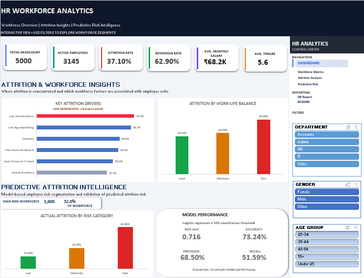
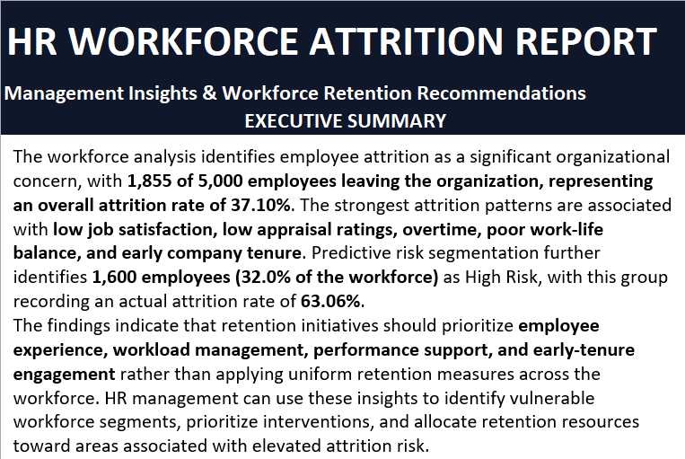

# HR Workforce Analytics — Attrition & Predictive Risk

### Interactive Excel HR Analytics | Workforce Intelligence | Predictive Modeling

An end-to-end HR analytics project built in **Microsoft Excel** to analyze workforce attrition, identify key employee risk factors, estimate attrition probability using **logistic regression**, and translate analytical findings into actionable retention recommendations.

The project analyzes **5,000 employee records** through an interactive executive dashboard, workforce segmentation, predictive risk modeling, and a management-focused HR report.

## 📊 Project Highlights

- **5,000** employee records analyzed
- **37.10%** overall attrition rate
- **1,600 employees** identified in the High-Risk segment
- **63.06%** actual attrition within the High-Risk segment
- Interactive filtering by **Department, Gender, and Age Group**
- Logistic regression attrition-risk model with **ROC-AUC of 0.716**
- Employee-level **Low, Moderate, and High** risk segmentation
- Management-focused retention recommendations and monitoring framework

## 🎯 Business Problem

Employee attrition can create significant workforce disruption through increased recruitment costs, loss of organizational knowledge, productivity gaps, and pressure on existing employees.

The objective of this project is to move beyond basic attrition reporting and answer three management-focused questions:

1. **Where is employee attrition concentrated across the workforce?**
2. **Which workforce factors are associated with higher attrition?**
3. **How can predictive analytics help HR prioritize employees or workforce segments for further retention assessment?**

The analysis therefore combines **descriptive HR analytics, interactive workforce segmentation, predictive risk modeling, and management recommendations** to support evidence-based retention decisions.

## 🔍 Analytical Objectives

- Measure overall workforce size, attrition, retention, compensation, and tenure.
- Analyze attrition across employee experience and workforce characteristics.
- Evaluate patterns associated with **job satisfaction, appraisal ratings, overtime, work-life balance, and tenure**.
- Build a logistic regression model to estimate employee attrition probability.
- Segment employees into **Low, Moderate, and High attrition-risk groups**.
- Translate analytical findings into practical HR retention priorities.
- Provide an interactive dashboard for workforce exploration by **Department, Gender, and Age Group**.

## ⚙️ Project Workflow

The project follows an end-to-end HR analytics workflow:

**Raw HR Data → Data Cleaning → Feature Engineering → Workforce Metrics → Attrition Analysis → Predictive Modeling → Risk Segmentation → Interactive Dashboard → Management Recommendations**

### 1. Data Preparation
- Preserved the original dataset in a dedicated `Raw_Data` worksheet.
- Created a structured `Clean_Data` layer for analysis.
- Standardized workforce variables and prepared analytical fields.
- Maintained all **5,000 employee records** throughout the data-preparation process.

### 2. Feature Engineering
Derived analytical variables were created to support workforce segmentation and attrition analysis, including:

`Attrition_Flag` • `Age_Group` • `Salary_Band` • `Tenure_Band` • `Role_Tenure_Band` • `Distance_Band` • `Satisfaction_Level` • `WLB_Level` • `Training_Band` • `Leave_Band`

### 3. Descriptive HR Analytics
Excel PivotTables and calculated metrics were used to evaluate:
- Workforce headcount and active employees
- Attrition and retention rates
- Compensation and tenure
- Job satisfaction
- Appraisal ratings
- Overtime
- Work-life balance
- Company and role tenure
- Training, leave, and commuting-distance patterns

### 4. Predictive Attrition Modeling
A **logistic regression model** was developed to estimate employee attrition probability using five workforce risk indicators:

- Low Job Satisfaction
- Low Appraisal Rating
- Overtime
- Poor Work-Life Balance
- Early Company Tenure

The model generates an employee-level attrition probability that is subsequently used for workforce risk segmentation.

### 5. Risk Segmentation
Employees were classified into **Low, Moderate, and High Risk** groups based on their predicted attrition probabilities. The resulting segments were validated against observed employee attrition to assess whether the model meaningfully differentiated workforce risk.

### 6. Interactive Reporting
The final Excel solution combines:
- Dynamic KPI cards
- Attrition-driver analysis
- Work-life balance analysis
- Predictive risk intelligence
- Department, Gender, and Age Group slicers
- Management-focused HR reporting and retention recommendations

## 📈 Key HR Insights

### 1. Low Job Satisfaction — Strongest Observed Attrition Signal
Employees with **Low Job Satisfaction recorded 51.48% attrition**, compared with the overall workforce attrition rate of **37.10%**.

This represents a **14.38 percentage-point increase** over the overall workforce rate, making low job satisfaction the strongest observed attrition signal in the analysis.

### 2. Low Appraisal Ratings
Employees receiving appraisal ratings of **1–2 recorded a combined attrition rate of 49.71%**.

The pattern suggests that employees experiencing lower performance outcomes may warrant further investigation around coaching, development, role alignment, and manager feedback.

### 3. Overtime
Employees working overtime recorded **43.60% attrition**, compared with **30.80%** among employees without overtime.

This indicates a meaningful association between overtime exposure and employee exits within the dataset.

### 4. Work-Life Balance
Employees reporting **Poor Work-Life Balance recorded 43.00% attrition**, compared with **29.91%** among employees reporting Good Work-Life Balance.

This highlights work-life balance as an important workforce experience factor for retention analysis.

### 5. Early Company Tenure
Employees with **1–2 years of company tenure recorded 40.23% attrition**.

Attrition subsequently declined across longer-tenure groups, indicating that the early employment period deserves particular attention in retention planning.

> **Interpretation Note:** These findings represent associations observed within the dataset and should not be interpreted as evidence that any individual factor directly causes employee attrition.
## 🧠 Predictive Attrition Intelligence

A logistic regression model was developed to estimate employee attrition probability using selected workforce risk indicators. Predicted probabilities were then used to segment the workforce into **Low, Moderate, and High Risk** categories.

### Risk Segmentation Results

| Risk Segment | Employees | Actual Attrition Rate |
|---|---:|---:|
| Low Risk | 1,852 | 19.28% |
| Moderate Risk | 1,548 | 31.59% |
| High Risk | 1,600 | 63.06% |

The **High-Risk segment represents 32.0% of the workforce** and recorded an actual attrition rate of **63.06%**. The progression from **19.28% → 31.59% → 63.06%** demonstrates meaningful separation between the model-generated risk segments within this dataset.

### Model Performance

| Metric | Result |
|---|---:|
| ROC-AUC | **0.716** |
| Accuracy | **73.24%** |
| Precision | **68.50%** |
| Recall | **51.59%** |
| F1 Score | **58.86%** |
| Classification Threshold | **50%** |

> **Model Evaluation Note:** Performance metrics are based on the same dataset used to fit the logistic regression model (**in-sample evaluation**). They demonstrate the analytical workflow and model discrimination within this dataset and should not be interpreted as independent out-of-sample predictive performance.

> **Responsible HR Use:** Risk scores are intended to support workforce prioritization and further HR assessment. They should not be used as standalone evidence for individual employment decisions.

## 💼 Management Recommendations

Based on the observed workforce patterns and predictive risk analysis, the following areas should receive priority attention:

| Priority Area | Recommended HR Response |
|---|---|
| **Job Satisfaction** | Use targeted pulse surveys, stay conversations, and manager-led action plans to investigate low-satisfaction workforce segments. |
| **Performance Support** | Strengthen coaching, development planning, role clarity, and feedback mechanisms for employees receiving lower appraisal ratings. |
| **Overtime & Workload** | Monitor sustained overtime exposure and review workload distribution, staffing capacity, and scheduling practices. |
| **Work-Life Balance** | Evaluate workload design and flexibility opportunities while monitoring WLB indicators across workforce segments. |
| **Early-Tenure Retention** | Strengthen onboarding, 30/60/90-day check-ins, mentoring, and structured retention conversations during employees' first two years. |
| **High-Risk Workforce** | Use predictive risk segmentation to prioritize further HR assessment and supportive interventions rather than automatic employment decisions. |

### Management Approach

The recommended strategy is to combine **workforce analytics, employee listening, managerial judgment, targeted interventions, and continuous outcome monitoring**.

Rather than applying uniform retention initiatives across the organization, HR can use these insights to identify workforce areas requiring deeper investigation, allocate retention resources more strategically, and evaluate whether interventions are followed by improved workforce outcomes.

## 📋 HR Management Report

In addition to the interactive dashboard, the workbook includes a dedicated **HR Workforce Attrition Report** designed to translate analytical findings into management-focused insights and retention priorities.

The report includes:

- Executive Summary
- Key Management Findings
- Recommended Retention Action Plan
- Management Prioritization
- Monitoring & Success Measures
- Management Takeaway

The report bridges the gap between **HR analytics and managerial decision-making**, demonstrating how workforce data can be converted into structured recommendations while maintaining appropriate caution around predictive risk interpretation.

## 🛠️ Tools & Skills Demonstrated

### Microsoft Excel
- Excel Tables and structured references
- PivotTables and PivotCharts
- Interactive slicers and report connections
- Dynamic KPI calculations
- Lookup and analytical formulas
- Conditional formatting
- Dashboard design and workbook navigation
- Data cleaning and feature engineering

### HR & People Analytics
- Employee attrition analysis
- Workforce segmentation
- Retention analysis
- Employee experience metrics
- KPI development and interpretation
- Risk-based workforce prioritization
- Management reporting

### Predictive Analytics
- Logistic regression
- Employee-level probability estimation
- Risk segmentation
- Classification threshold analysis
- Confusion-matrix evaluation
- ROC-AUC
- Accuracy, Precision, Recall and F1 Score

### Business & Management Skills
- Translating analytical findings into HR insights
- Developing evidence-based retention recommendations
- Management prioritization
- KPI monitoring frameworks
- Responsible interpretation of predictive HR analytics

## 📁 Workbook Structure

| Worksheet | Purpose |
|---|---|
| `HR_Analytics_Dashboard` | Interactive executive dashboard presenting workforce KPIs, attrition insights, predictive risk intelligence, and slicer-based workforce exploration. |
| `HR_Report` | Management-oriented report containing executive findings, retention recommendations, prioritization, and monitoring measures. |
| `README` | In-workbook project documentation covering objectives, methodology, insights, model interpretation, limitations, and navigation. |
| `HR_Metrics` | Workforce and employee-experience KPI calculations supporting the analytical outputs. |
| `Attrition_Analysis` | PivotTables and supporting calculations used to analyze attrition across workforce characteristics. |
| `Predictive_Risk` | Logistic regression calculations, employee attrition probabilities, risk segmentation, model evaluation, and risk register. |
| `Clean_Data` | Cleaned and feature-engineered employee dataset used throughout the analysis. |
| `Raw_Data` | Original source dataset preserved as the raw analytical input. |

### 🔄 Dashboard Interactivity

The dashboard includes interactive slicers for:

**Department • Gender • Age Group**

These filters dynamically update the descriptive analytics layer, including:

- Total Headcount
- Active Employees
- Attrition Rate
- Retention Rate
- Average Monthly Salary
- Average Tenure
- Key Attrition Drivers
- Work-Life Balance Analysis

> **Predictive Dashboard Note:** The Predictive Attrition Intelligence section presents overall model results and does not recalculate when dashboard slicers are applied.
> 

## 📊 Dataset & Data Source

This project uses the **HR Attrition Indian Dataset**, containing **5,000 employee records** and workforce-related attributes covering demographics, employment characteristics, compensation, tenure, performance, employee experience, and attrition status.

### Dataset Coverage

The source data includes variables related to:

- Employee demographics
- Department and designation
- Education qualification
- Monthly salary
- Company and role tenure
- Appraisal ratings
- Training hours
- Job satisfaction
- Work-life balance
- Overtime
- Distance from home
- Leave utilization
- Employee attrition status

**Source:** Kaggle — HR Attrition Indian Dataset  
**License:** CC0 / Public Domain

> **Data Note:** The dataset is used for educational and portfolio-based HR analytics. Employee names and records are treated as synthetic/anonymized data and should not be interpreted as confidential workforce information from a real organization.

The original dataset is preserved in the workbook's `Raw_Data` worksheet, while the `Clean_Data` worksheet contains the prepared and feature-engineered analytical dataset.

## ⚠️ Limitations & Responsible Interpretation

This project is designed as an HR analytics and predictive modeling portfolio case study. The following limitations should be considered when interpreting the results:

- **Association, not causation:** The identified workforce factors are associated with attrition within this dataset. The analysis does not establish that these factors directly cause employees to leave.
- **In-sample model evaluation:** The logistic regression model was evaluated using the same dataset on which it was fitted. Reported performance metrics therefore demonstrate model discrimination within this dataset rather than independent out-of-sample predictive performance.
- **Risk scores are not definitive predictions:** Employee-level probabilities represent statistical risk estimates and should not be interpreted as certainty that an individual employee will leave.
- **Management judgment remains essential:** Predictive outputs should support—not replace—HR assessment, employee conversations, organizational context, and managerial judgment.
- **Dataset-specific findings:** Relationships identified in this dataset may not generalize to other organizations, industries, workforce populations, or time periods.
- **Ethical use of People Analytics:** Predictive risk information should be used to support employee retention, workforce planning, and further investigation—not as standalone justification for adverse employment decisions.

## 🔐 Responsible HR Analytics Principle

> **Use analytics to identify where HR should investigate and support—not to automatically decide what should happen to an employee.**

The purpose of the predictive layer is to help prioritize workforce attention while maintaining appropriate human oversight and contextual decision-making.
